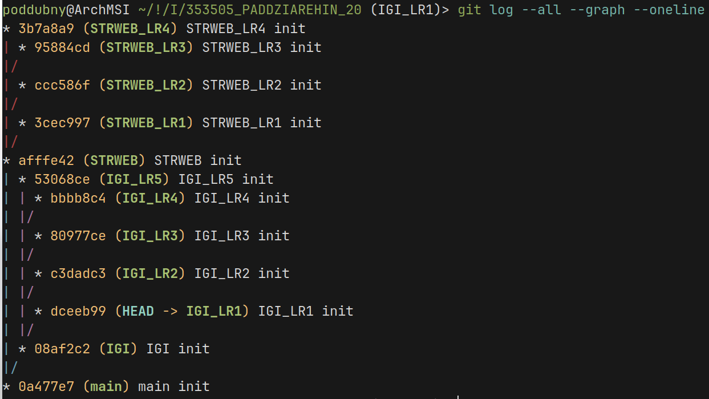
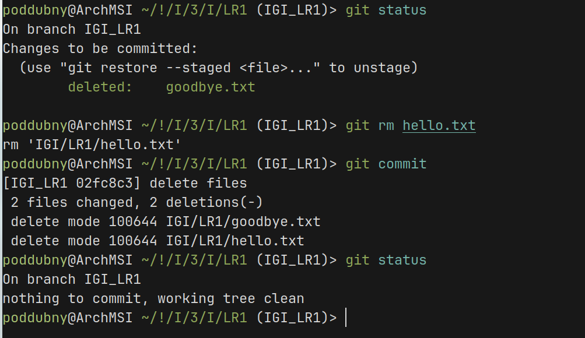
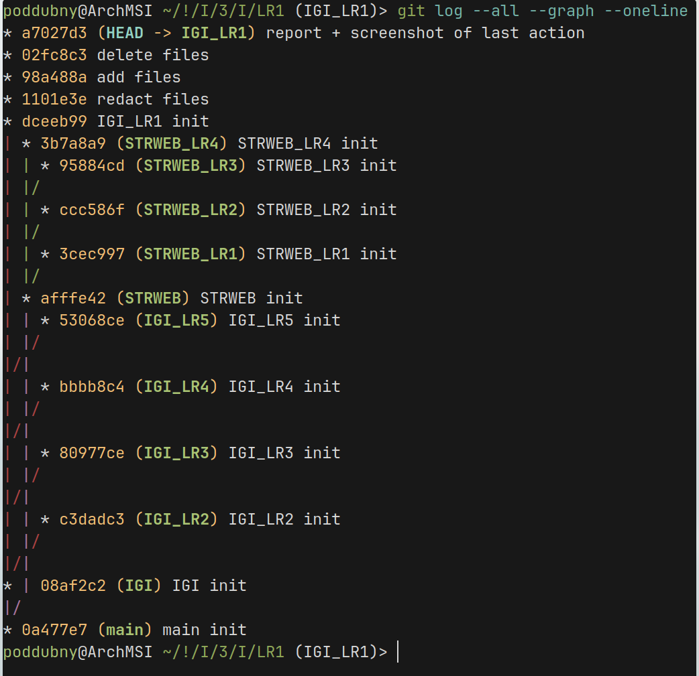
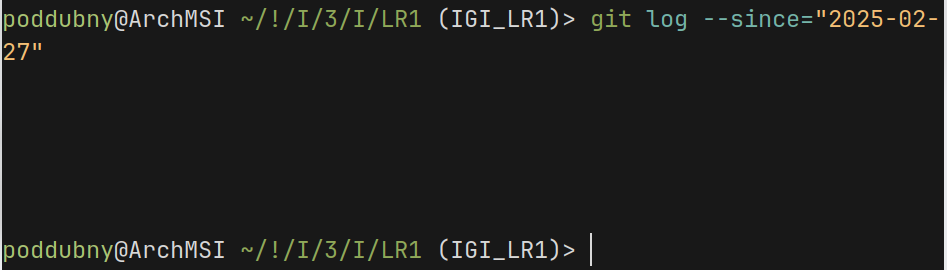
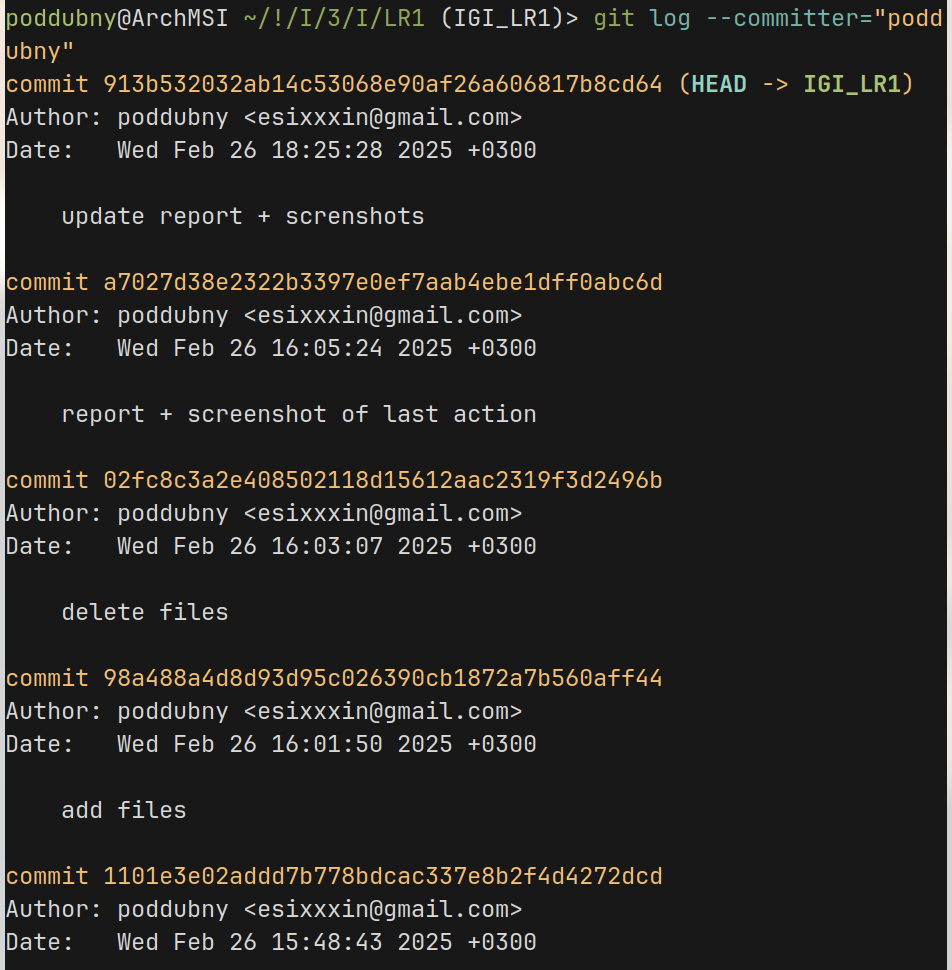
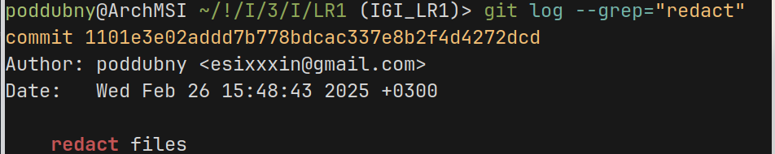
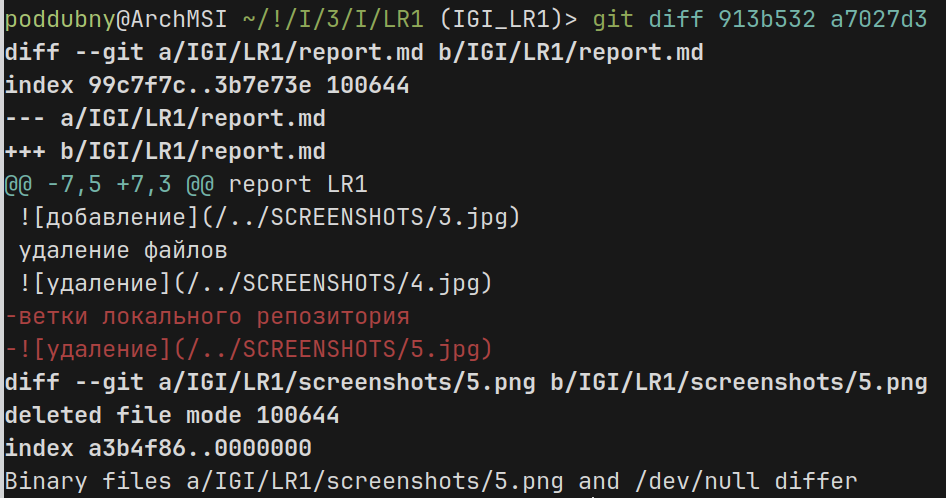

структура репозитория
report LR1

внесение изменений в файлы:

добавление файлов

удаление файлов

ветки локального репозитория

вывод нескольких коммитов с помощью флага n

вывод с помощью флага since

вывод с помощью коммитов committer и author(отличие в том, что author - тот кто написал код(внес изменения), а committer - тот кто закоммитил в репозиторий)

вывод коммитов по комментариям к коммиту

флаг stat

различие между двумя коммитами

отмена коммита

отмена индексации

