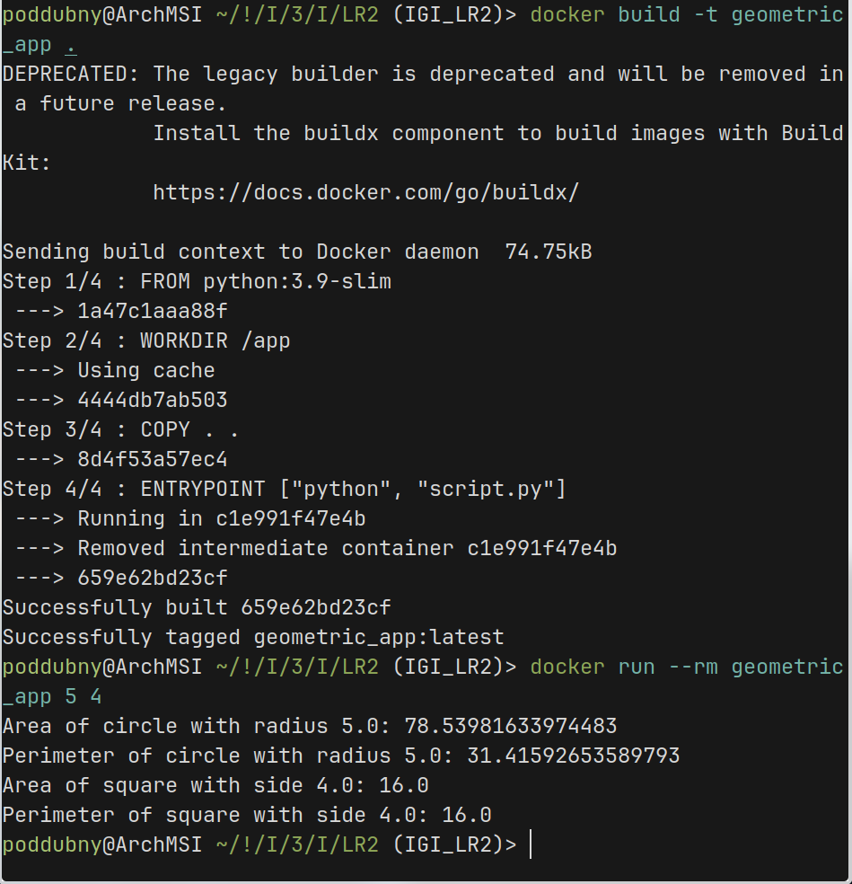
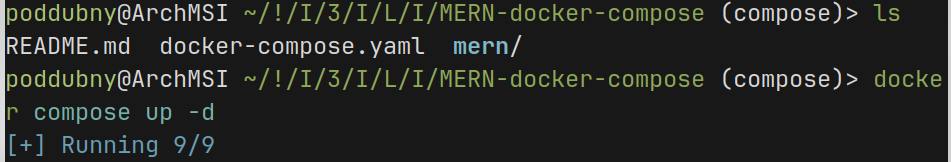
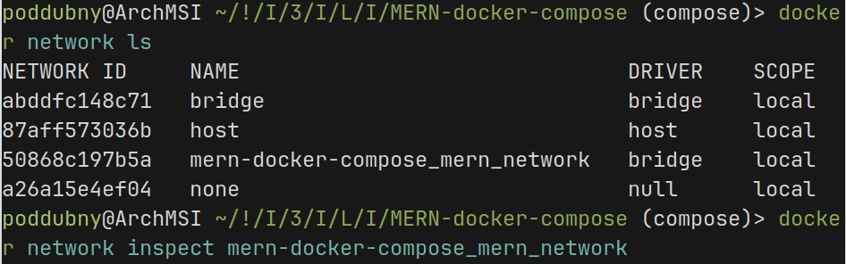
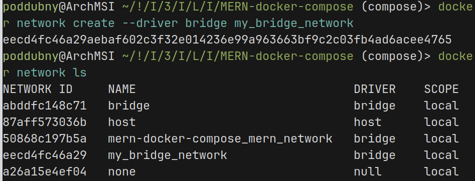
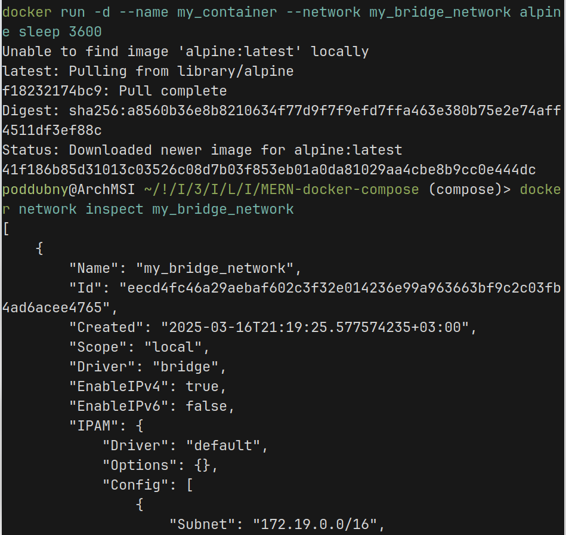
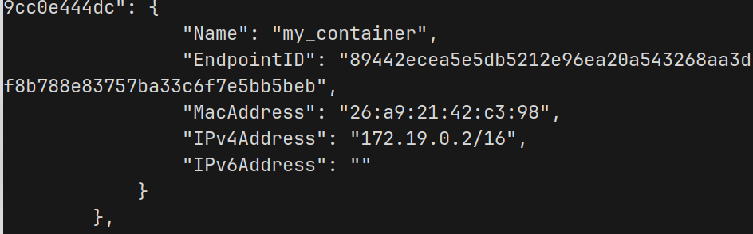
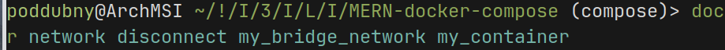
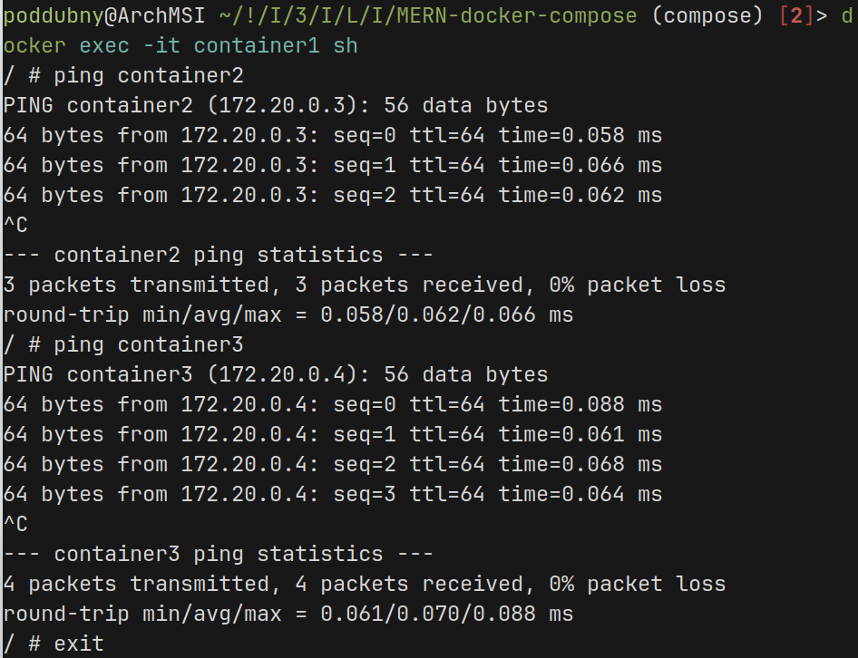
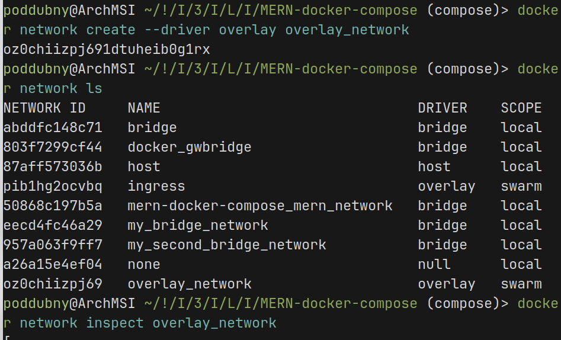

сборка образа используя скрипт из библиотеки geometric_lib

поднятие docker compose

сеть для обеспечения связи между контейнерами

создание сети bridge

добавление контейнера в сеть и получение информации о сети

ip adress контейнера через сеть

отключение сети от контейнера

пинг других контейнеров подключенных по сети

создание сети overlay

